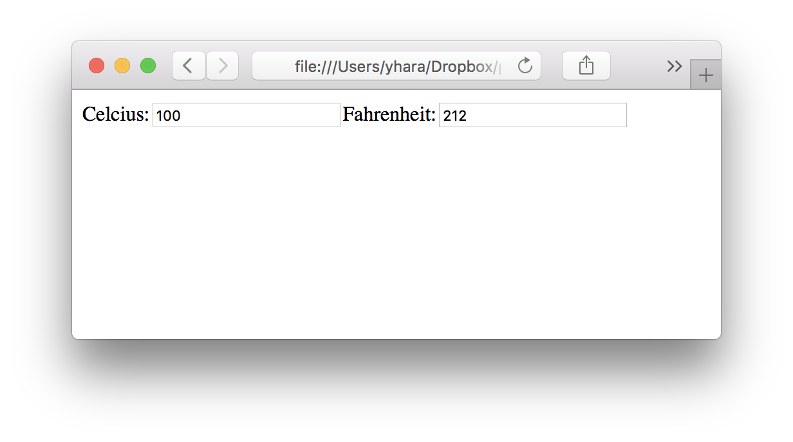

# Ovto

Client-side web framework for Opal, inspired by hyperapp

## Documents

- [Book](https://yhara.github.io/ovto/)
- [yardoc](https://yhara.github.io/ovto/api/)

## Example



```rb
require 'ovto'

class MyApp < Ovto::App
  class State < Ovto::State
    item :celsius, default: 0

    def fahrenheit
      (celsius * 9 / 5.0) + 32
    end
  end

  class Actions < Ovto::Actions
    def set_celsius(state:, value:)
      return {celsius: value}
    end

    def set_fahrenheit(state:, value:)
      new_celsius = (value - 32) * 5 / 9.0
      return {celsius: new_celsius}
    end
  end

  class MainComponent < Ovto::Component
    def render(state:)
      o 'div' do
        o 'span', 'Celcius:'
        o 'input', {
          type: 'text',
          onchange: ->(e){ actions.set_celsius(value: e.target.value.to_i) },
          value: state.celsius
        }
        o 'span', 'Fahrenheit:'
        o 'input', {
          type: 'text',
          onchange: ->(e){ actions.set_fahrenheit(value: e.target.value.to_i) },
          value: state.fahrenheit
        }
      end
    end
  end
end

MyApp.run(id: 'ovto')
```

See the [book](https://yhara.github.io/ovto/guides/tutorial.html) for details.

## Setup

### Static

[./example/static](./example/static) demonstrates how to convert Ovto app
into a .js file.

### Ovto + Sinatra

[./example/sinatra](./example/sinatra) demonstrates how to serve Ovto app
from Sinatra.

### Ovto + Rails

[yhara/vision](https://github.com/yhara/vision) is a working example of using Ovto with Rails 5.

## Acknowledgements

- [hyperapp](https://github.com/hyperapp/hyperapp)

## Contact

https://github.com/yhara/ovto/issues
